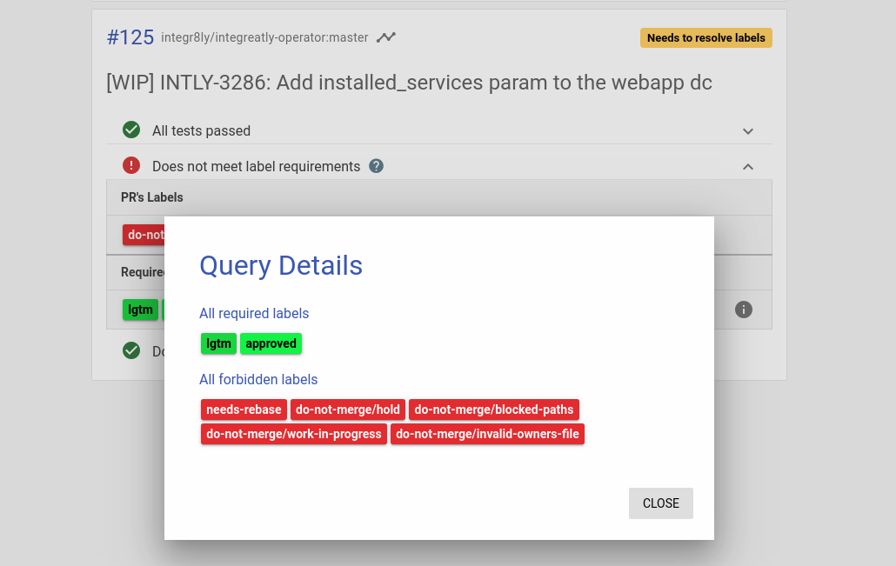

# Prow Pull Request Workflow

Prow workflow plugins are enabled and as such we are now following the code review process as defined in the kubernetes [Code Review Process](https://github.com/kubernetes/community/blob/master/contributors/guide/owners.md#the-code-review-process)

It is recommended that you read the code review document linked, but the flow is roughly:

1. PR is opened, 
1. The PR owner should identify an appropriate person(s) to review the PR and ask them directly or via chat. You can alternatively ask for a review from a specific person by commenting "/cc @gitubid", or adding it into the PR description on creation  
1. CI will suggest an approver to assign. This person is someone who is in the "approvers" list and able to mark the PR as approved after all reviews have been completed
1. A reviewer reviews the code and when happy, comments "/lgtm", and CI will apply a "lgtm" label to the PR
1. An approver should then comment "/approve", assuming they do approve of the changes, and CI will apply an "approve" label to the PR
1. Note, someone who is both an "approver" and "reviewer" can apply both of these states at the same time in the same comment.
   ```
   /lgtm
   /approve
   ```

At this point the PR is reviewed and approved and considered good to merge.

## Tide (Automated Merging of PRs)

If the prow tide plugin is enabled on the repository, prow will automatically merge PRs once they meet a certain criteria. 

* Must have labels on the PR, "lgtm" and "approved", see process above
* Must not have any excluded labels on the PR (i.e. do-not-merge/work-in-progress etc..) 
* All required prow jobs must have passed.

The criteria to allow a PR to be considered good to merge can be different between repos, to view what the criteria is you can view it on the prow PR details page, [PR details page](https://prow.svc.ci.openshift.org/pr?query=is%3Apr+repo%3Aintegr8ly%2Fintegreatly-operator+author%3AJameelB+head%3AINTLY-3286)



It is important to remember that once this criteria is met, the CI merge bot will put that into the merge pool and it **will** get merged. You should think of commenting "/approve" as hitting merge.

Prow does not only merge PRs, but also ensures that PRs are tested against the most recent base branch commit before they are allowed to merge. More info on tide functionality can be found here [Tide Plugin](https://github.com/kubernetes/test-infra/tree/master/prow/cmd/tide)

If a number of PRs are approved at a similar time, tide will queue these merge requests in order for it to ensure that all changes going back are tested with the latest base version. 
This can often lead to tide appearing to take a long time or even being completely stuck merging. In order to determine where your PR is in the queue you can view the [Tide Status View](https://prow.svc.ci.openshift.org/tide)
If you are still unsure about why it is taking a long time to merge, you can also view the [Tide for PR Authors](https://github.com/kubernetes/test-infra/blob/master/prow/cmd/tide/pr-authors.md) guide.

## Useful Links

* [Code Review Process](https://github.com/kubernetes/community/blob/master/contributors/guide/owners.md#the-code-review-process)
* [Tide Plugin](https://github.com/kubernetes/test-infra/tree/master/prow/cmd/tide)
* [Tide for PR Authors](https://github.com/kubernetes/test-infra/blob/master/prow/cmd/tide/pr-authors.md)
* [Tide Status View](https://prow.svc.ci.openshift.org/tide)