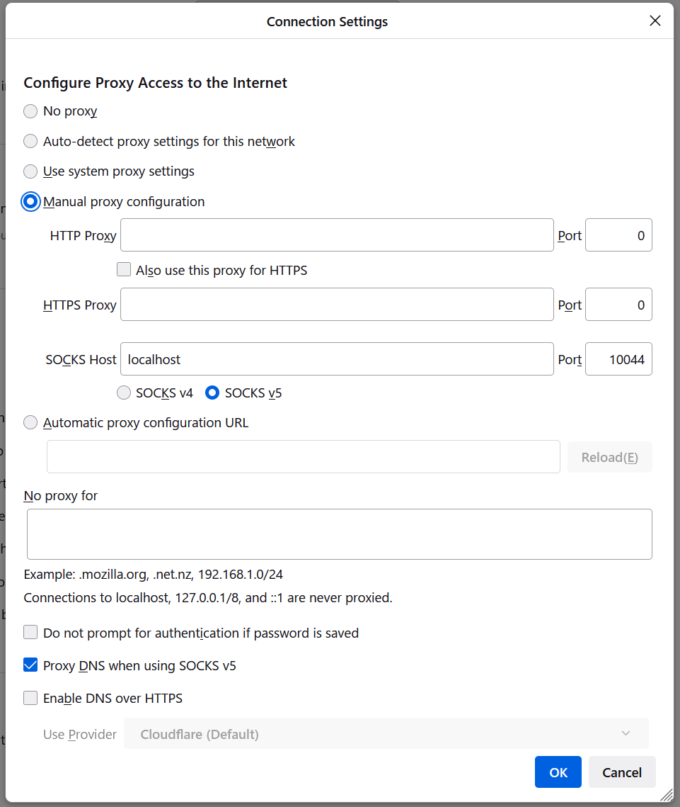

# RHOAM Private Link

This guide aims to support engineers configuring Private Link cluster and installing RHOAM on it. 
The guide uses a couple of other documents as it's source:

1. https://github.com/yuhkih/rosa-nw-template
2. https://github.com/integr8ly/integreatly-operator/blob/master/test-cases/tests/installation/a45-rhoam-on-rosa-byovpc-privatelink.md


## Pre-requisites

1. [AWS CLI](./supporting-documents/aws-cli.md#aws-cli)
2. [ROSA CLI](./supporting-documents/rosa-cli.md#rosa-cli)
3. [JQ](./supporting-documents/jq-cli.md#jq-cli)
4. [Local copy of this repository](./supporting-documents/repo-local-copy.md#repo-local-copy)
5. AWS UI Access


## Create required AWS resources

To create the required AWS resources CloudFormation stack creation will be used using below templates. Depending on whether you need Single AZ or Multi AZ installation, a different template must be used.

Navigate to AWS UI Cloud Formation and create the required stack for your installation using the:

[Signle AZ template](./supporting-files/rosa-private-single-az.yaml)

or

[Multi AZ template](./supporting-files/rosa-private-multi-az.yaml)

Note: By default - us-east region will be used. If however, you want to change the region please update the region in rosa private templates used ( `AvailabilityZoneSelection` section ) and in bastion-ssh templates.


## Provisioning ROSA cluster

To provision ROSA cluster with Private Link:

1. Login to OCM Stage environment
```
ocm login --url staging --token=<your token>
```
2. Export AWS access key and secret access key
```
export AWS_ACCESS_KEY_ID=<your key>
export AWS_SECRET_ACCESS_KEY=<your secret key>
```
3. Export Subnets created by the template

On the CloudFormation screen, select the created stack and go to the "Output" tab, and the Private Subnet ID should be displayed. (If you deployed a Single AZ Network with CloudFormation, only RosaPrivateSubnetID1 will exist.)

```
export SUBNET1=<subnet 1 ID>
export SUBNET2=<subnet 2 ID>
export SUBNET3=<subnet 3 ID>
```
```
export SUBNETS=$SUBNET1,$SUBNET2,$SUBNET3
```
4. Run Delorean command to provision ROSA cluster

Export additional envs:
```
export CLUSTER_NAME=<desired name of your cluster>
export NODE_COUNT=<6 is a default and recommmended value, node count depends on cluster being Mulit-AZ or Single-AZ and on Quota used within RHOAM>
```
Run the following command from Delorean repository
```
make ocm/rosa/cluster/create STS=true AWS_REGION=us-east-1 PRIVATE_LINK=true MULTI_AZ=<true for multi az or false for single az> COMPUTE_NODES=$NODE_COUNT SUBNET_IDS=$SUBNETS CLUSTER_NAME=$CLUSTER_NAME MACHINE_CIDR=10.0.0.0/16 BYOVPC=true
```
Note. Default region of us-east-1 is used, if the region used is different, please update accordingly.

5. Wait for cluster to finish provisioning.
Run the following command to observer the cluster provisioning state:
```
rosa logs install -c $CLUSTER_NAME --watch
```
Alternatively, you can fetch cluster state via OCM command:
```
CLUSTER_ID=$(ocm get clusters | jq -r --arg CLUSTER_NAME "$CLUSTER_NAME" '.items[] | select(.name==$CLUSTER_NAME)' | jq '.id' | tr -d '\"')
ocm get subs --parameter search="cluster_id = '$CLUSTER_ID'" | jq -r '.items[0].metrics[0].health_state'
```

## Create Bastion host

In order to be able to use `oc` against the cluster or access the cluster via the browser, a bastion host is required.
Depending on whether you are using single az or multi-az and access type required - create bastion host via AWS Cloud Formation using the following files:

### For SSH / Browser access:

[Single-AZ-bastion-ssh-template](./supporting-files/bastion-single-az-ssh.yaml)

[Mulit-AZ-bastion-ssh-template](./supporting-files/bastion-multi-az-ssh.yaml)

### For Session Manager access (AWS UI)

[Single-AZ-bastion-ssm-template](./supporting-files/bastion-single-az-ssm.yaml)

[Mulit-AZ-bastion-ssm-template](./supporting-files/bastion-multi-az-ssm.yaml)

## Bastion configuration

If you decided to go for bastion with ssh/browser access navigate to AWS Route53 > Hosted Zones and find the hosted zone for the rosa cluster you have provisioned.
Click on it and `edit` - scroll down to `VPCs to associate with the hosted zone` and add Bastion VPC to the VPC list. Save and exit.

Open two seperate terminal windows and run in the first one:

```
./docs/private-link/supporting-files/port-forward.sh 1
```
Then in the second one:
```
./docs/private-link/supporting-files/port-forward.sh 2
```
From now on, you should be able to communicate with your ROSA cluster from the second terminal.

## Accessing Cluster via SSH

### Side note

In both cases, `oc` cli might be missing - if this happens please install `oc`:
```
curl -LO https://mirror.openshift.com/pub/openshift-v4/clients/oc/latest/linux/oc.tar.gz
tar -xvf oc.tar.gz
sudo mv oc /usr/local/bin/
```

### Obtaining the cluster credentials

Retrieve cluster api URL and kubeadmin password by running the following command from your machine:
```
ocm get /api/clusters_mgmt/v1/clusters --parameter search="name like '%$CLUSTER_NAME%'" | jq -r '.items[0].api.url'
CLUSTER_ID=$(ocm get /api/clusters_mgmt/v1/clusters --parameter search="name like '%$CLUSTER_NAME%'" | jq -r '.items[0].id')
ocm get /api/clusters_mgmt/v1/clusters/$CLUSTER_ID/credentials | jq -r .admin.password
```

#### For SSH / Browser access:

After running the bastion configuration, for your second terminal window you should be able to oc into the cluster. 
Then run:
```
oc login https://<your-api-url-piece-from-command-above> -u kubeadmin -p <password>
```

#### For Session Manager

In AWS UI, find the Bastion EC2 instance created (which was created by the template), click on Connect and select "Session Manager".
Then run:
```
oc login https://<your-api-url-piece-from-command-above> -u kubeadmin -p <password>
```

## Accessing cluster via Browser

Note: Browser access can be done when using the SSH / Browser Access Bastion and it's configuration.

- From the bastion host run:
```
dig +short console-openshift-console.apps.<WILDCARD_DOMAIN>
```
For example:
```
dig +short console-openshift-console.apps.mstoklus-pl.g68z.s1.devshift.org
```

- This produces 2 IP numbers, take note of them. For example:
```
10.0.1.143
10.0.1.70
```

- Edit hosts file
`sudo vim /etc/hosts`
- Add one of the IPs from previous command with cluster domain, for example:
`10.0.1.143    .apps.mycluster.xb5p.p1.openshiftapps.com`
- In Firefox, go to `Settings` and type `Network Settings` and set the `SOCKS Host` along with `Proxy DNS when using SOCKS v5`



## Installing RHOAM

- Run the following command to install RHOAM on ROSA cluster created in previous steps:

```
rosa install addon managed-api-service --cluster $CLUSTER_NAME --addon-resource-required true --rosa-cli-required true --billing-model standard --region us-east-1
```
Note: The command might fail initially, if it does, try it again in few minutes.

- Since we are using staging environment, RHMI CR needs to be patched with `useClusterStorage` value. To do this, it's required to connect to the bastion
instance created by template via Session Manager.

Via oc command:
```
oc patch rhmi rhoam -n redhat-rhoam-operator --type=merge -p '{"spec":{"useClusterStorage": "false" }}'
```
- Wait for installation of RHOAM to complete
```
oc get rhmi -o yaml -n redhat-rhoam-operator
```

## Cleaning up

- Once finished, RHOAM addon should be uninstalled first, this can be done via UI or ROSA command:

```
rosa uninstall addon --cluster=$CLUSTER_NAME managed-api-service -y
```
- Once addon is removed, cluster can be deleted via OCM UI
- Once cluster is removed, all templates from the Cloud Formation should be removed as well

